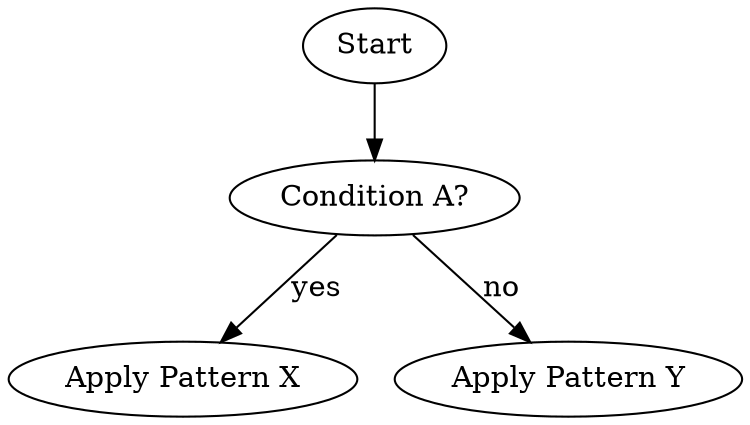

# <Skill Title>

> Template purpose: create high-quality skills that are discoverable, testable, and resistant to rationalization.
>
> Core rule: if you did not run a baseline scenario without the skill and watch failure first, you do not know if the skill teaches the right behavior.

## Skill Type
Pick one type and keep the rest of the template aligned with it:
- `Technique` (how-to execution method)
- `Pattern` (mental model / decision model)
- `Reference` (lookup and application guidance)

Selected type:
`<Technique|Pattern|Reference>`

## Required Background / Required Sub-Skill
Use explicit requirement markers when needed:
- **REQUIRED BACKGROUND:** `<superpowers:skill-name or None>`
- **REQUIRED SUB-SKILL:** `<superpowers:skill-name or None>`

Example:
`**REQUIRED BACKGROUND:** You MUST understand superpowers:test-driven-development before using this skill.`

## Frontmatter Rules (must pass)
- `name` uses only letters, numbers, and hyphens.
- Frontmatter total length is <= 1024 characters.
- `description` starts with **"Use when..."**.
- `description` explains **when to use**, not workflow details.
- `description` is third-person and trigger-focused.
- `description` should stay <= 500 characters.
- `description` must not summarize the skill's process steps.

**Good description example**
```yaml
description: Use when implementation has clear feature requirements and work must follow strict TDD before production code.
```

**Bad description example**
```yaml
description: Use to write tests first, verify failure, implement minimal code, and refactor.
```

## Overview
<1-2 sentence explanation of the skill's core principle and why it matters.>

Example:
`This skill enforces deterministic execution under deadline pressure by requiring explicit gates before proceeding.`

## When to Use
- <trigger/symptom 1>
- <trigger/symptom 2>
- <trigger/symptom 3>
- Keywords people will search: <error message>, <synonym>, <tool>, <artifact>.

## When NOT to Use
- <non-applicable context 1>
- <non-applicable context 2>

## Quick Reference
| Situation | Action | Why |
|---|---|---|
| <situation> | <what to do> | <expected benefit> |
| <situation> | <what to do> | <expected benefit> |
| <situation> | <what to do> | <expected benefit> |

## Implementation
### Core Pattern
<Describe the core pattern in 3-6 bullets. Keep concrete and reusable.>

### Optional decision flow (only if non-obvious)


### Minimal example
```markdown
<Put one strong, adapted example here (not five weak examples).>
```

### Supporting files (optional)
If needed, link heavy reference or reusable tooling:
- `<supporting-file.md>` for long reference.
- `<script-or-template-file>` for reusable tooling.

## Common Mistakes
| Mistake | Why it fails | Fix |
|---|---|---|
| <common failure> | <failure reason> | <concrete correction> |
| <common failure> | <failure reason> | <concrete correction> |
| <common failure> | <failure reason> | <concrete correction> |

## Rationalization Table (Excuse vs Reality)
| Excuse | Reality |
|---|---|
| "<rationalization heard in testing>" | <direct counter-rule> |
| "<rationalization heard in testing>" | <direct counter-rule> |
| "<rationalization heard in testing>" | <direct counter-rule> |

## Red Flags - STOP
- "<this is different just this once>"
- "<we can do tests after>"
- "<manual validation is enough>"
- "<skip gate and fix later>"

**If any red flag appears:** stop, re-enter the defined process from the required starting point.

## TDD for Skills (mandatory)

### Test mode by skill type
| Skill Type | Primary test style | Pass condition |
|---|---|---|
| Technique | Application scenarios | Agent applies method correctly in new context |
| Pattern | Recognition + decision scenarios | Agent identifies when to apply / not apply |
| Reference | Retrieval + application scenarios | Agent finds correct info and applies it correctly |

### RED - Baseline Failure Without Skill
- [ ] Create pressure scenario(s) with at least 3 pressures (time, sunk cost, authority, exhaustion, etc.).
- [ ] Run scenario **without** this skill.
- [ ] Capture failure behavior and rationalizations verbatim.
- [ ] Confirm failure reason is behavioral (not prompt typo/tool error).

Pressure scenario template:
```markdown
IMPORTANT: This is a real scenario. Choose and act.

Context: <concrete constraints, deadlines, stakes>
Options:
A) <option>
B) <option>
C) <option>

Choose one and justify.
```

### Validation artifacts layout (required)
```text
skills/<skill-name>/validation/
  pressure-scenarios.md
  test-log.md
```

`pressure-scenarios.md` minimum:
- At least 3 scenarios with concrete pressure (time, authority, ambiguity, sunk cost, etc.).
- Forced options (A/B/C) and the exact line: `Choose one and justify.`

`test-log.md` minimum:
- RED table with failure behavior and verbatim rationalizations.
- GREEN table with pass/fail result and evidence lines.
- REFACTOR table with loophole, counter added, and retest result.

### GREEN - Minimal Skill to Address Observed Failures
- [ ] Add only rules needed to counter RED failures.
- [ ] Add explicit negations for likely loopholes.
- [ ] Keep wording precise and operational.
- [ ] Re-run same scenario with skill loaded.
- [ ] Confirm compliance under pressure.

### REFACTOR - Close Loopholes, Stay Green
- [ ] Collect new rationalizations from GREEN runs.
- [ ] Update Rationalization Table and Red Flags.
- [ ] Tighten ambiguous wording.
- [ ] Re-run pressure scenarios after each update.
- [ ] Verify compliance remains stable.

## Real-World Impact (optional)
Use only concrete outcomes from real usage:
- `<measurable outcome 1>`
- `<measurable outcome 2>`
- `<before/after observation>`

## Quality Gate Before Publishing (must all pass)
- [ ] **Discoverability:** name/description are trigger-focused and searchable.
- [ ] **CSO constraints:** frontmatter <= 1024 chars and description <= 500 chars.
- [ ] **Clarity:** "When to Use" and "When NOT to Use" are explicit and non-overlapping.
- [ ] **Testability:** baseline RED evidence exists and is documented.
- [ ] **Anti-rationalization:** top observed loopholes have explicit counters.
- [ ] **Operationality:** quick reference and implementation sections are action-oriented.
- [ ] **Token efficiency:** no redundant prose; no repeated instructions across sections.

## Publication Checklist
- [ ] File location is correct: `skills/<skill-name>/SKILL.md` (or approved path).
- [ ] Supporting files are included only when needed.
- [ ] Skill was tested with pressure scenarios before publishing.
- [ ] Changelog/docs were updated if repository policy requires it.

## Final Notes
- Skills are reusable reference guides, not retrospective stories.
- If a requirement can be fully enforced by automation, automate it; reserve skill text for judgment calls.
